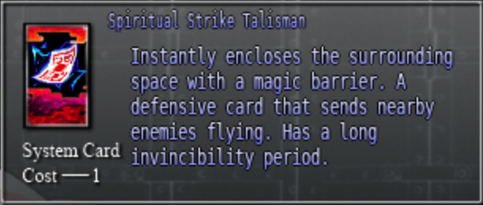
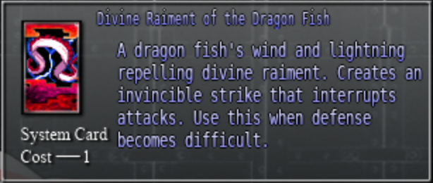
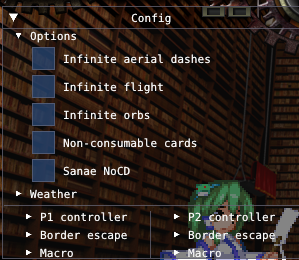

```toc

```

## General

### What is Touhou 12.3: Hisoutensoku?

Hisoutensoku is a 1v1 fighting game spinoff of the Touhou series. It is notable for putting a unique spin on the genre by successfully blending elements inspired by the series of bullet hell games.

### Why should I play it?

- If you are already a touhou fan, this is widely considered to be the best fighting game spinoff in the series. It’s also the most actively played online touhou game.
- Rollback netcode, allowing for a better online experience than most other fighting games available today.
- The game has an incredibly high skill ceiling, with unbelievable tactical and strategic depth on a layer not commonly seen. This allows you to continuously develop as a player, and makes this a game worth sticking to for the long haul. To illustrate this point, there are frequently new discoveries and meta shifts being made by active players even 10 years after its release.
- A solid game balance, with a low spread between character tiers.
- A great degree of flexibility in playstyles and player expression allowed through the customizable deck system, as well as the free flowing nature of the game. Establish your own deck/playstyle and reach for the stars [?!]
- There really is no other game quite like it. Its unique systems such as grazing and its defensive mechanics set it apart from other fighting games making it feel fresh, while still sharing enough fundamental aspects with other fighting games to teach you transferable skills.
- A large international presence, with the game still appearing in international majors such as EVO. In 2020’s EVO Japan the game had 60 entrants.
- Ongoing support through various community updates such as quality of life mods.
- Fairly low execution barrier, making it keyboard friendly. There’s no half circle inputs here.
- The game's design effectively captures the spirit of a Bullet Hell game, making even optimal play look and feel hype and explosive, as if the players are taking part in a live action spell duel.

### Where do I get it?

Refer to the [Downloads](/game/download) page.

### Is it hard to learn?

Due to the unique nature of the game, a lot of your experience in fighting games might not initially carry over as well as you’d expect. However once you get used to the mechanics of the game things will start to come quite naturally and you’ll be feeling the rush of controlling your character with unmatched freedom in no time!

### Who can I play with?

Because the game is [P2P](https://en.wikipedia.org/wiki/Peer-to-peer) based and has no inbuilt matchmaking, there are multiple communities across the world to facilitate games with playable latency. Check out the [region](/region) page to find one suitable for you.

### What input device should I be using?

The game will work fine with any input method, though certain gamepads, sticks, and hitboxes may require a free third party tool such as [Xpadder](https://www.xpadder.com/)/[Joy2Key](https://joytokey.net/en/). If your stick has Left Stick mode, then the game should work natively with that. The game is notably keyboard friendly, so you won’t be disadvantaged for using one.

### How do I join someone’s host?

1. Copy the IP:Port (Eg: `110.150.131.209:10800`) of the host with `ctrl+c`.
2. Go to the vs network menu in game and select ‘Connect to IP from Clipboard’.
3. That’s all! If someone’s already in the host you’ll be given an option to spectate instead.

## Character

### Who is a good character to pick as a new player?

Marisa, Tenshi, Reisen, Meirin, Cirno, Aya \
These characters are all rounders who teach you the basics of the game well.

But most importantly, pick a character that you like!

### Who are the strongest characters?

Although the meta is often shifting around, as of 2020 it seems to be Yuyuko/Udonge/Iku/Sakuya.

### I was told my favourite character is weak, should I give up?

No! The game is well balanced, and although tiers do exist, every character is viable. Different matchups might expose character weaknesses, and deck customisation can change a character dramatically allowing you to work around some matchups. Player skill will ultimately determine the outcome of matches, even against the top tier characters.

### Which character should I play if I want...

|                                  |                                                     |
| -------------------------------- | --------------------------------------------------- |
| Really cool combos               | Aya, Youmu, Patchouli, Marisa                       |
| Massive hitboxes                 | Komachi, Utsuho, Iku, Alice, Yuyuko, Suwako, Yukari |
| Big damage                       | Utsuho, Suika, Tenshi, Marisa, Yuyuko               |
| To be super fast                 | Aya, Youmu, Marisa, Meiling, Remilia, Cirno         |
| To be great at escaping pressure | Remilia, Meiling, Youmu                             |
| To fill the screen with bullets  | Patchouli, Reimu, Sanae, Sakuya, Alice, Yuyuko      |
| To have oppressive pressure      | Reisen, Tenshi, Aya, Yukari, Sakuya                 |

Or, you can refer to this handy chart: \
**[OCE 12.3 FAQ Character Chart](https://docs.google.com/spreadsheets/d/1-Fetj3dJaI9tvn77Eg3afgIuTAi9qc6ZdwZs-nDu-4A/edit#gid=0)**

### Just show me a tier list!

There are multiple tier lists and different people will have varying opinions.

This is a 2020 tier list made by Keima, Japan’s strongest Youmu player (this is just the view of one player and is open for debate): \


Browse other tier lists: \
https://hisouten.koumakan.jp/wiki/Tier_List

## Learning

### Every time I attack I’m stuck in the animation for ages! Is there anything I can do about this?

Like many other fighting games, you can cancel your attacks into various other actions instead of waiting for the animation to end. **Refer to the following handy chart to see what cancels into what:**


### The opponent’s movements are so fluid! How can I move like them?

- Get used to **High Jump Cancelling grounded bullets by holding 7/8/9** while firing them, and **flight cancelling air bullets by holding any direction + d** while firing them. This alone will greatly improve your mobility!
  - You can also Air Dash Cancel air bullets by pressing 66/44 after firing them.
- Also make sure that **whenever you want to leave the ground, you always High Jump** (upwards direction + d or 27/28/29) instead of Normal Jump (upwards direction).
- Finally, don’t be afraid to use the entire screen, try flying upwards after a high jump to gain some altitude and then fly back down to the ground.
  - Since you only get 2 air movements, always make sure you do the second flight downwards so you don’t end up falling from high up with no movements left.

### My opponent’s moving straight through my projectiles, what’s going on?

In this game, players can enter a state called ‘Graze’ where they pass through projectiles unharmed. You want to be Grazing most of the time in neutral.

**You can Graze immediately from the first frame when you do any of the following movements:** \
Ground Dash (6d), Back Dash (4d), Air Dash (66), Flight(direction +d), High Jump (upwards direction +d).

### I’m stuck in the corner for the whole match! What do I do?!

If you end up being knocked down, you can **roll left or right on wake up by holding 6 + d or 4 + d**. There’s no vulnerability for doing this so it’s a good idea to roll out of the corner on wake up to go back to mid screen.

Regardless of which character you’re using, by default you should have the following defensive cards included in your deck (your meter):

<!-- The styling on the section is a bit hacky - image size would otherwise be made too big due to gatsby-remark-images -->

**Spirit Strike**

<div style="width: 350px; margin: auto;">
  
</div>
This is an invincible move! Try using this one if the opponent’s pressuring you to blow them away.
Even though it can't be done during block or hitstun, this has an effect similar to a 'Burst' from Guilty Gear or BlazBlue.
<br/>
<br/>

**Hangeki**

<div style="width: 350px; margin: auto;">
  
</div>
This is an invincible move! Try using this one right after you’ve blocked a move to do a counter attack. Because it's a guard cancel, it won't do anything if you're not in blockstun. It's exactly like a guard cancel from any other game (GG, BB, UNI, A3, etc.).
<br/>
<br/>
And don’t forget that you can Graze bullets, you don’t have to block them!

### The timer’s weird, it counts up sometimes and has weathers in it! What’s up with that?

In this game, there’s no timer (this generally doesn't present as a problem, either). Instead it shows what weather is coming up, or is presently active. Active weathers will temporarily change the game with attributes like lifesteal or faster movement. Although learning weathers will play a significant part in your development later on, it can be overwhelming to new players and is **best left until you are comfortable with other base mechanics**.

If you’re curious though, check out the resources channel mentioned below and look for the weather section!

### I suddenly can’t block and neither of our characters flinch, what’s going on?

This is maybe the only weather you’ll need to really watch out for as a new player. If you see ‘Typhoon’ pop up on screen, you won't be able to block for its entire duration, but you’ll also not flinch.\
If you’re at low HP, it’s best to run away during this, but on the contrary if the opponent’s on low HP chase them down and finish them off!

### There’s so many cards, how can I decide what to use?

While it’s fun to play around with all the different available cards, the sheer number of them can make it pretty overwhelming when you’re starting out. Luckily for you, the copy of the game available here comes with beginner oriented decks on the green <span style="color: green">喜</span> deck slot for every character.

### What’s a 236b? Why are the moves written as numbers?

This game uses numpad notation for its moves. Refer to the following chart on how to interpret those numbers:
 \
A = Melee, B = light bullet, C = heavy bullet, D = flight

### Is there a summary of available resources?

Check the [resources page](/resources) and the #resouces channel under Information in the [international server](https://discord.gg/MbNzxpy)

These tutorial videos are a great place to start for learning the mechanics of the game: \
https://youtu.be/RnW-6c_H6KU \
https://youtu.be/9xlKyKLVFZI

This website auto records replays and decks of all matches played on the international server. Check out the character tab on the top to filter down to replays and decks of the top ranking players for each character: \
https://sokureplays.delthas.fr/

### What should I focus on to improve?

The most important thing when you’re new is to play a lot of matches to get comfortable with the controls, game mechanics, and your character. If you want to focus on something specific, once you’ve learned about the basic mechanics listed on this page and mentioned in the tutorial video above, it’s a good idea to go over some basic bnb combos found in the resource channel above for your character to improve your damage potential.

Don’t be afraid to ask your opponent for advice either, as your opponent would have been in your shoes once and I'm sure would be very willing to help out!

### The practice mode menu doesn't seem that good for labbing. Is there a better way to lab in this game?

_The following assumes you are using PracticeEx and ReplayInputViewer mods._

There’s a few hotkeys that will come in handy when labbing:

- Reset position with 1, and save position with 2.
  - Holding left/right while pressing 1 will reset to the respective corner.
- Reset skills to default level 0 with 4.
- Toggle infinite HP/spirit in non practice mode offline modes like vs player with F1.
- Fill your hand with F2, clear your hand and reset your deck with F3.
- Toggle hitbox display with F4.
- Toggle input displays with F7.
- Speed up and slow down the game with F9 and F10 respectively.
- Toggle pause with F11 and move forward by 1 frame during this pause with F12.
- Toggle state display with backspace.
  - Transparent = grazing state
  - Red = counter hit state
  - Blue = invincible
  - Purple = unable to block
- You can fix, and cycle through weathers in non practice mode offline modes with F5. This is useful when using the dummy actions mentioned above in VS player mode.
- In VS player mode, you can press various numbers from 3-0 to toggle different dummy actions. Refer to the CMD window to check what each number does. Make sure to press F1 to toggle infinite HP!
- The CMD window that opens up with the game will also display frame advantage information in real time.
- You’ll notice a little triangle on the top right of your screen in offline modes. Click this to expand it to reveal all sorts of options like a macro and infinite flights/airdashes.
  - By default all the infinite orbs/flight etc options are turned on, so make sure to untick these by clicking with your mouse when practicing if you want to better represent the conditions in a match:
    

If you’re unsure of how to lab something, don’t hesitate to ask!
